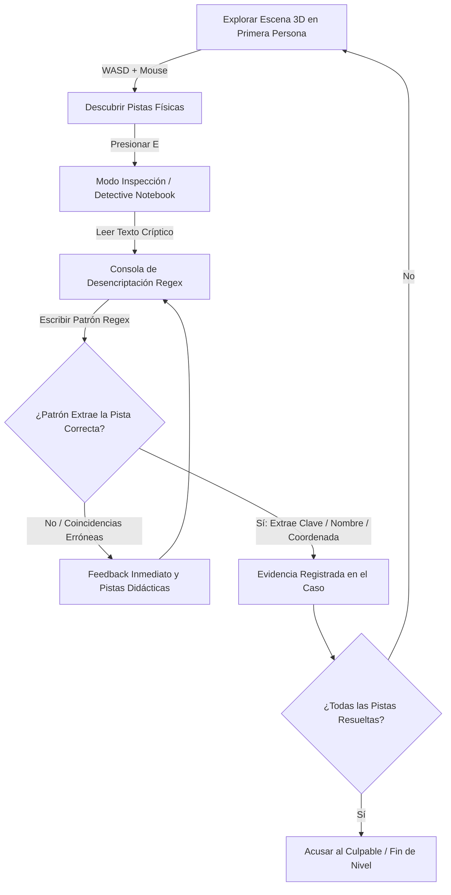

# 🕵️‍♂️ REGEX: THE CRIME — Documento de Diseño y Especificación Técnica

## 1. Visión General del Proyecto
**"Regex: The Crime"** es un videojuego web de misterio e investigación en primera persona con estética retro **3D Pixel-Art / Low-Poly PS1 Noir**. El jugador encarna a un detective (privado o del departamento de policía) que debe investigar escenas del crimen atmosféricas, recolectar pistas físicas (recortes de periódico, notas de chantaje, tickets manchados de sangre, agendas telefónicas) y descifrar patrones ocultos mediante el poder de las **Expresiones Regulares (Regex)** para incriminar a los sospechosos y desmantelar el caso.

---

## 2. Análisis y Selección del Stack Tecnológico

Evaluamos las opciones para la renderización gráfica 3D en primera persona con estética pixel-art:

| Opción | Pros | Contras | Veredicto |
| :--- | :--- | :--- | :--- |
| **A. Solo JavaScript (Canvas 2D Raycaster)** *(estilo Wolfenstein 3D)* | Cero dependencias externas; look retro auténtico por cuadrícula. | Sin verticalidad (no se puede mirar arriba/abajo), difícil inspeccionar objetos 3D en las manos, iluminación plana, colisiones rígidas. | ❌ Descartado |
| **B. Three.js + Vite (JavaScript / Modern Web)** | **Excelente rendimiento**, control total de cámara en 1ra persona (`PointerLockControls`), soporte para modelos low-poly, shaders retro, sistema de partículas (lluvia, humo) y renderizado a baja resolución escalado con pixel art (`image-rendering: pixelated`). Rápido de iterar y modular. | Requiere Three.js como librería base (~600kb). | ✅ **RECOMENDADO** |
| **C. Babylon.js** | Muy completo para físicas complejas. | Sobrecarga de bundle mayor, configuración más pesada para una estética indie minimalista. | ⚠️ Alternativa secundaria |
| **D. Godot Web / PlayCanvas** | Editor visual completo. | Tiempos de carga altos, problemas de compatibilidad WebAssembly/WebGL en algunos navegadores móviles/escritorio, difícil integración con UI HTML/CSS estilizada para el terminal de Regex. | ❌ Descartado |

### Decisión de Arquitectura Gráfica:
- **Tecnología**: **Vite + Three.js + Vanilla JS + CSS3 moderno** (para la UI del Cuaderno de Detective y Terminal Regex).
- **Técnica 3D Pixel Art**: 
  1. Renderizado interno de Three.js en resolución reducida (ej. **480x270** o **640x360** con relación de aspecto 16:9).
  2. Canvas escalado a pantalla completa con `image-rendering: pixelated` y `crisp-edges`.
  3. Paleta de colores neo-noir atmosférica (sombras profundas, luces de farola color ámbar, neón rojo/azul, textura dithered).
  4. Inspección de pistas en 3D (al presionar `E` cerca de una pista, esta se eleva frente a la cámara con una lupa interactiva).

---

## 3. Mecánica de Juego (Core Gameplay Loop)



1. **Investigación 3D**:
   - Movimiento en primera persona (`W, A, S, D`, correr con `Shift`, interactuar con `E` o click).
   - Linterna de detective (`F`) para iluminar rincones oscuros y revelar notas ocultas.
   - Retícula reactiva que cambia de color o pulsa al mirar objetos interactivos (cintas policiales, cajones, periódicos, teléfonos).
2. **Terminal de Evidencia / Cuaderno de Notas**:
   - Al interactuar con una pista, se abre una vista interactiva estilo máquina de escribir / cuaderno de detective noir.
   - El jugador ve el texto de la evidencia (ej: una lista de llamadas telefónicas, un manifiesto de pasajeros, una nota de extorsión).
   - Se le presenta el objetivo detectivesco (ej: *"El asesino solo llamó a números de la zona norte que empiezan con 555 y terminan en 7. Encuentra el patrón Regex para aislarlos."*).
   - **Evaluador en Tiempo Real**: Resalta coincidencias en vivo con animación de tinta/rotulador.
   - **Explicador Didáctico**: Si el jugador comete un error, el cuaderno ofrece notas del detective con pistas de sintaxis (`\d`, `[A-Z]`, `+`, `*`, `^`, `$`, etc.).

---

## 4. Diseño de los 3 Niveles de Prueba Iniciales

### 📍 Caso 1: *"El Chantaje en el Callejón Lluvioso"* (Nivel Introductorio)
- **Escenario 3D**: Un callejón oscuro tras un club de jazz, charcos con reflejos, lluvia pixelada, contenedores de basura y una farola parpadeante.
- **Pista 1**: *Nota de chantaje arrugada en un cubo de basura*.
  - **Texto**: Múltiples importes de dinero mezclados con divagaciones (`"Pagame $500 antes de las 12 o te costara $12000... pero si avisas a la policia seran $999999!"`).
  - **Objetivo Regex**: Capturar todos los montos de dinero válidos con formato `$[0-9]+` o `\$\d+`.
- **Pista 2**: *Matrícula en el fango de un auto sospechoso*.
  - **Texto**: Registro de coches en el club (`"CAR-1234", "TAXI-99", "MET-8841", "NYPD-01"`).
  - **Objetivo Regex**: Matrículas de 3 letras mayúsculas seguidas de un guion y 4 dígitos (`[A-Z]{3}-\d{4}`).
- **Resolución**: Se identifica el auto del extorsionador y la suma exigida.

---

### 📍 Caso 2: *"El Cuarto 404 del Hotel Noir"* (Nivel Intermedio)
- **Escenario 3D**: Habitación de hotel desordenada, cama con cinta de escena del crimen, mesa con máquina de escribir, lámpara verde de banquero y un teléfono de disco.
- **Pista 1**: *Registro de llamadas en la libreta telefónica*.
  - **Texto**: Lista de llamadas con formatos variados `(555) 123-4567`, `555-987-6543`, `+1-555-444-2222`.
  - **Objetivo Regex**: Filtrar números que pertenezcan al código de área `555` usando grupos y cuantificadores `\(?555\)?[-. ]?\d{3}[-. ]?\d{4}`.
- **Pista 2**: *Recorte del periódico "The Daily Chronicle"*.
  - **Texto**: Párrafos del periódico con fechas de crímenes sospechosos (`"14/03/1947"`, `"09-11-1946"`, etc.).
  - **Objetivo Regex**: Fechas válidas en formato `DD/MM/AAAA` o `DD-MM-AAAA`.
- **Resolución**: Cruzando la fecha y el número de teléfono, se descubre la coartada falsa del principal sospechoso.

---

### 📍 Caso 3: *"La Caja Fuerte del Banquero Corrupto"* (Nivel Avanzado)
- **Escenario 3D**: Despacho de un banco antiguo con estanterías de caoba, alfombra roja, escritorio de madera y un cuadro que oculta una caja fuerte con cerradura alfanumérica.
- **Pista 1**: *Cuentas bancarias y transacciones clandestinas*.
  - **Texto**: Transferencias bancarias con códigos alfanuméricos tipo `ACC-US-9821-X`, `ACC-CH-4412-A`.
  - **Objetivo Regex**: Identificar cuentas de paraísos fiscales suizos (`CH`) que terminen en letra `A` o `B` usando anclas y clases `^ACC-CH-\d{4}-[AB]$`.
- **Pista 2**: *Contraseña encriptada en la agenda del banquero*.
  - **Texto**: Lista de palabras clave; la contraseña es la única que tiene entre 8 y 12 caracteres, al menos una mayúscula y al menos un dígito.
  - **Objetivo Regex**: Validación con clases y cuantificadores de longitud o condiciones específicas.
- **Resolución**: Se abre la caja fuerte, revelando los documentos que incriminan al cerebro de la mafia.

---

---

## 5. Arquitectura del Sistema de 50 Niveles (10 Tiers de Dificultad)

El juego cuenta con un catálogo de **50 casos criminales** organizados en **10 Tiers** con progresión de dificultad cada 5 niveles:

| Tier | Niveles | Rango Policial | Mecánica de Presión | Conceptos de Regex |
| :--- | :--- | :--- | :--- | :--- |
| **Tier 1** | **01 - 05** | ⭐ *Recluta de Patrulla* | Sin límite de tiempo, intentos libres. | Búsqueda literal, banderas `/i` y `/g`, corchetes simples. |
| **Tier 2** | **06 - 10** | ⭐⭐ *Oficial de Ronda* | **5 Vidas / Intentos** (❤️❤️❤️❤️❤️). | Negación `[^...]`, metacaracteres `\d`, `\s`, cuantificador `+`. |
| **Tier 3** | **11 - 15** | ⭐⭐⭐ *Detective de Distrito* | **⏱️ Tiempo: 90s** + 5 Vidas. | Matrículas `[A-Z]{3}-\d{4}`, `\w`, fechas `\d{2}/\d{2}/\d{4}`. |
| **Tier 4** | **16 - 20** | 🎖️ *Brigada Antinarcóticos* | **🕵️ Trampas del Criminal** + ⏱️ 80s + 4 Vidas. | Criptoanálisis inverso: predecir salidas de regex criminales. |
| **Tier 5** | **21 - 25** | 🎖️🎖️ *Investigador de Homicidios* | **⏱️ Tiempo: 60s** + 4 Vidas. | Límites de palabra `\b`, anclas de inicio `^` y fin `$`. |
| **Tier 6** | **26 - 30** | 🎖️🎖️🎖️ *Forense de Inteligencia* | **🕵️ Cifrados de Mafia** + ⏱️ 55s + 3 Vidas. | Grupos de captura `(...)`, alternancia `\|`, retroreferencias `\1`. |
| **Tier 7** | **31 - 35** | 🏅 *Agente Especial Encubierto* | **⏱️ Tiempo: 45s** + 3 Vidas. | Cuantificadores perezosos `.*?`, clases negadas `[^"]*`, no-captura. |
| **Tier 8** | **36 - 40** | 🏅🏅 *Unidad de Delitos Mayores* | **🕵️ Criptografía Bancaria** + ⏱️ 40s + 3 Vidas. | Lookaheads positivos `(?=...)`, negativos `(?!...)`, contraseñas. |
| **Tier 9** | **41 - 45** | 🏅🏅🏅 *Auditoría Antiterrorista* | **⏱️ Tiempo: 35s** + 3 Vidas. | Detección de ReDoS exponencial `^(a+)+$`, refactorización lineal. |
| **Tier 10** | **46 - 50** | 🏆 *Comisionado Maestro Forense* | **Extremo: ⏱️ 30s** + 2 Vidas. | Redadas contrarreloj, detonadores de C4 y la Bóveda Secreta. |

---

## 6. Estructura del Código y Componentes

```
regex-the-crime/
├── index.html                   # Canvas 3D, HUD por Tiers y Cuaderno Dual (Construcción / Criminal)
├── src/
│   ├── main.js                  # Inicialización y ciclo principal
│   ├── data/
│   │   └── FullLevelsData.js    # Catálogo de 50 niveles con 10 Tiers, tiempos y retos inversos
│   ├── core/                    # Motor Three.js, Controles PointerLock y Audio Web API
│   ├── world/                   # Escenas 3D (Alley, Hotel, Office) y LevelManager
│   ├── ui/                      # HUD, NotebookUI (Timer + Vidas + Criptoanálisis), AcademyUI
│   ├── academy/                 # Modo Academia Forense (10 lecciones didácticas estilo W3Schools)
│   └── regex/                   # Motor seguro de compilación y evaluación Regex
```
