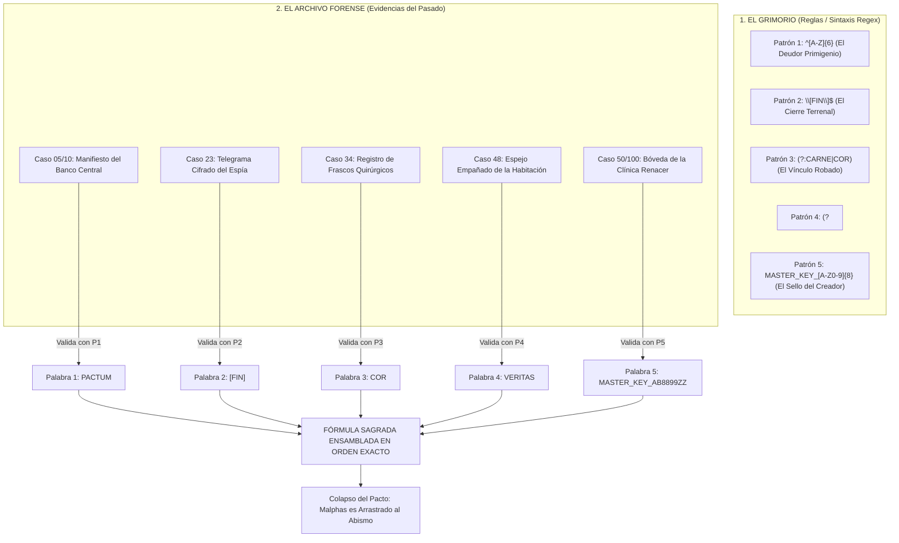

# 🗂️ EXPEDIENTE CONFIDENCIAL: LA HISTORIA DE "REGEX: THE CRIME"

> *"La carne de los pecadores compra los años de los poderosos... pero el contrato final siempre se cobra en sangre."*

---

## 📖 1. SINOPSIS GENERAL (EL GRAN COMPLOT)

En la superficie de la ciudad de **New Haven (1947)**, el detective privado **Vincent Vance** solo ve la típica podredumbre humana: extorsión, asaltos nocturnos, contrabando en los muelles y banqueros lavando dinero sucio.

Sin embargo, debajo de la niebla urbana opera un engranaje siniestro compuesto por tres vértices:

1. **La Clínica de la Élite ("Clínica Renacer / Sanitas Aeterna"):** Un sanatorio privado de superlujo en las colinas de la ciudad, donde magnates ancianos, políticos corruptos y jueces pagan fortunas millonarias por someterse a cirugías clandestinas de sustitución de órganos para rejuvenecer y extender su vida más allá del límite biológico.
2. **El Sindicato de los Taxidermistas ("La Hermandad del Bisturí"):** Una despiadada organización criminal contratada por la clínica para cazar a las personas compatibles, eliminarlas sin dejar rastro biológico y extraer sus órganos en furgones frigoríficos en menos de 15 minutos. Como beneficio adicional, los sicarios saquean los apartamentos, cajas de seguridad, joyas y cuentas bancarias de las víctimas para financiar su imperio criminal.
3. **El Pacto Demoníaco (La Entidad: *Malphas, El Arquitecto del Abismo*):** Los criminales no eligen a sus víctimas al azar. Años atrás, el líder del sindicato invocó a un demonio cobrador de deudas mediante un pacto de sangre. El demonio les entrega listas codificadas con los nombres, residencias y tipos sanguíneos de personas que en el pasado vendieron su alma o hicieron pactos con él a cambio de fama, fortuna o curas milagrosas. Al estar ya "condenadas por contrato", sus cuerpos pueden ser cosechados sin que ninguna autoridad divina intervenga.

4. **El Grimorio Olvidado y el Conjuro de Patrones:** Al inicio de su carrera, Vance incauta un viejo libro de ocultismo que describe la estructura de conjuros para someter entidades oscuras. Vance lo desecha como simple superstición de charlatanes. Sin embargo, al final descubrirá que **el libro no contiene las palabras mágicas literales, sino la fórmula sintáctica y los patrones (expresiones regulares)** que deben tener. Para destruir al demonio, el detective se verá forzado a rebuscar en las evidencias físicas y documentos recolectados a lo largo de los 100 casos, aislar las palabras reales que coinciden con esos patrones y ensamblarlas en el orden sagrado exacto.

---

## 👥 2. PERSONAJES Y OBJETOS CLAVE

| Elemento | Rol en la Historia | Descripción |
| :--- | :--- | :--- |
| **Vincent Vance** | Protagonista / Detective | Exinvestigador de homicidios caído en desgracia. Obsesivo con los patrones, las máquinas de escribir y los cuadernos forenses. |
| **Dra. Evelyn Cross** | Antagonista Científica | Directora médica de la Clínica Renacer. Una prodigio de la cirugía obsesionada con derrotar la vejez y la muerte mediante trasplantes biomecánicos oscuros. |
| **Carmine "El Carnicero" Falcone** | Antagonista Criminal | Capo del hampa local. Maneja las morgues clandestinas, los camiones frigoríficos (`TRUCK-XXX-X`) y el saqueo de viviendas. |
| **Malphas (El Cobrador)** | Antagonista Sobrenatural | Demonio antiguo con aspecto de aristócrata de traje negro y ojos de azufre. Suministra los nombres de las víctimas a cambio de la desesperación y el sufrimiento de la ciudad. |
| **Frankie "Dedos" Miller** | Informante / Víctima Clave | Falsificador y cerrajero que trabajaba para el sindicato saqueando las cajas fuertes de los asesinados, hasta que descubrió la verdad y dejó pistas cifradas antes de huir. |
| **El Tratado de los Ecos (Grimorio)** | Objeto Clave / Catalizador | Antiguo tomo incautado al principio. No contiene conjuros cerrados, sino **las reglas de los patrones (la sintaxis Regex)** para romper contratos del inframundo. |

---

## 🗺️ 3. ESTRUCTURA NARRATIVA: PROGRESIÓN POR TIERS (100 CASOS)

### 🟢 ACTO I: El Día a Día de un Policía (Niveles 1 a 10)
*Casos aparentemente aislados y mundanos. El detective asume que solo investiga el crimen común de la ciudad.*
- **Nivel 01 - 05:** El Callejón de Miller y notas de hotel de baja estofa. Pequeños hurtos y sospechosos habituales.
- **El Hallazgo del Libro Ignorado:** En una redada a una tienda de empeños clandestina ligada a estafadores, Vance confisca un extraño libro encuadernado en piel oscura: *"El Tratado de los Ecos"*. El texto habla de geometrías lingüísticas, leyes de invocación y patrones verbales para expulsar demonios. Vance sonríe con escepticismo, lo califica de "chifladura de fanáticos" y lo arroja al fondo de su maletín de archivos sin prestarle mayor atención.
- **Nivel 06 - 10:** Huéspedes sospechosos en el Hotel Savoy y claves de cajas de seguridad (`KEY-[1-5]`) en el banco central.
- *Giro sutil:* En la caja fuerte del Nivel 10, Vance encuentra un fajo de billetes con una lista de nombres tachados con tinta roja... pero lo atribuye a simples deudas de juego.

---

### 🟡 ACTO II: Las Marcas del Bisturí (Niveles 11 a 20 - Tier 2)
*La violencia escala. Empiezan a aparecer cadáveres desvalijados con precisión médica.*
- **Nivel 11 - 15:** Carreras contrarreloj en los muelles de carga (`[A-Z]{3}-\d{4}`), contenedores criogénicos (`BOX_\d{2}`), y transferencias de dinero sucio (`TX-XXXXX`).
- **Nivel 16 - 20:** La primera bomba con trampa de Falcone (`^BOMB-`), frascos de sueros inmunosupresores (`\d+g`) y maletines con listas de apartamentos desvalijados.

---

### 🟠 ACTO III: El Rastro de la Carne y el Saqueo (Niveles 21 a 50 - Tiers 3, 4 y 5)
*Vance descubre la conexión entre la mafia de Falcone y la Clínica Renacer.*
- **Nivel 21 - 30 (Tier 3 - Detective de Distrito):** Interrogatorios bajo la lluvia (`\bRob\b`). Vance descubre que las víctimas de los allanamientos tenían citas privadas en la clínica antes de desaparecer. Aparecen los telegramas sellados con `\[FIN\]$` y la cámara frigorífica `V\d{5}`.
- **Nivel 31 - 40 (Tier 4 - Delitos Especiales):** Testimonios judiciales sobre rituales nocturnos, etiquetas de órganos `[PISTA_ALPHA]`, censo de deudores faustianos `(?:REF|ID)-\d{4}`, y las cajas con dinamita de Falcone `Caja(?=\sPELIGRO)`.
- **Nivel 41 - 50 (Tier 5 - Investigador de Homicidios):** Ataque ReDoS demoníaco en los servidores (`^(a+)+$`), detonadores de TNT en los cimientos del hospital (`TNT-\d{4}-[AB]`), interceptación de camiones frigoríficos y asalto a la puerta de cirugía mayor (`MASTER_KEY_[A-Z0-9]{8}`).

---

### 🔴 ACTO IV: La Revelación Oculta (Niveles 51 a 80 - Tiers 6, 7 y 8)
*El horror sobrenatural emerge. Los contratos no son mercantiles: son espirituales.*
- **Nivel 51 - 60 (Tier 6 - Forense de Inteligencia):** Compatibilidad genética HLA antinatural (`HLA-[A-Z]{2}-\d{3}`), nitrógeno líquido portuario, grabaciones donde el conserje balbucea que *"el hombre del traje negro no tiene sombra"* y las cuentas secretas en Suiza.
- **Nivel 61 - 70 (Tier 7 - Agente Encubierto):** Citas textuales de confesiones médicas (`".+?"`), dosificación de conservante celular, frascos de corazones robados (`{COR}`) y tokens de la junta directiva (`AUTH-[A-Z0-9]{6}`).
- **Nivel 71 - 80 (Tier 8 - Delitos Mayores):** Tarifas clínicas con lookbehinds (`(?<=COSTE:\s)\$\d+`), líquidos seguros, runas grabadas en la piedra de la cripta (`RUNE_[A-F0-9]{4}`) y el cerrojo de la bóveda de Malphas (`VAULT-[A-Z]{2}-\d{4}`).

---

### 🟣 ACTO V: El Exorcismo Forense (Niveles 81 a 100 - Tiers 9 y 10)
*Redada en el santuario subterráneo de la Clínica Renacer. La entidad demoníaca se manifiesta para reclamar la ciudad entera.*
- **Nivel 81 - 90 (Tier 9 - Auditoría Antiterrorista):** Sabotajes de repetición anidada, detonadores de mercurio, coches bomba en el callejón de escape, huellas no humanas y la apertura del portal rúnico con el *Tratado de los Ecos* (`OPEN_GATE_[A-Z]{4}`).
- **Nivel 91 - 95 (Tier 10 - Comisionado Maestro):** Lecturas de la firma espectral de Malphas (`MALPHAS_AURA_\d{3}`), detonador C4 supremo, runas en el espejo de azufre y detención de la purga de expedientes.
- **Nivel 96 - 100 (El Gran Exorcismo):** El enfrentamiento final en la Bóveda Secreta de la Clínica. Vance descifra las 4 estrofas del *Tratado de los Ecos* cotejando las evidencias pasadas:
  1. *Estrofa 1 (Nivel 96):* `^[A-Z]{6}` -> `PACTUM` (El Banco).
  2. *Estrofa 2 (Nivel 97):* `\[FIN\]$` -> `[FIN]` (Los Telegramas).
  3. *Estrofa 3 (Nivel 98):* `(?:CARNE|COR)` -> `COR` (Los Frascos Quirúrgicos).
  4. *Estrofa 4 (Nivel 99):* `(?<!DEMON)VERITAS` -> `VERITAS` (El Espejo).
  5. *Conjuro Maestro (Nivel 100):* `MASTER_KEY_[A-Z0-9]{8}` abre el arcón arcano, calcina el contrato con fuego azul y destierra a Malphas para siempre.

---

## 🔮 4. LA MECÁNICA FINAL: EL GRIMORIO DE LOS PATRONES Y EL CONJURO FORENSE

Para derrotar a **Malphas**, las balas y las esposas son inútiles. El demonio solo puede ser obligado a retirarse y anular el pacto si el detective resuelve el gran enigma lingüístico:

### ¿Cómo funciona el rompecabezas para el jugador?
1. **El Grimorio define el patrón y el orden:** El libro confiscado en el Acto I enumera 5 estrofas. Cada estrofa describe una regla Regex matemática (por ejemplo: *"Una palabra de 6 mayúsculas que selle un trato al inicio"*, *"Un ancla que corte la frase al final del renglón"*, *"Una alternativa sagrada entre los órganos hurtados"*).
2. **El Jugador rastrea sus evidencias pasadas:** El jugador no inventa las palabras de la nada. Abre su cuaderno de archivo y revisa los casos que ya superó. En los documentos de esos casos se encuentran las palabras auténticas que encajan a la perfección con cada patrón del grimorio.
3. **El Ensamblaje Final:** En la consola de la bóveda del demonio, el jugador teclea la expresión regular compuesta en el orden prescrito por el libro para ejecutar el conjuro.

---

## 🎭 5. EPÍLOGO: EL PRECIO DE LA VERDAD

Cuando Vance introduce la regex definitiva en la terminal de la bóveda:
- El contrato demoníaco arde en llamas azules espontáneas.
- Los pacientes millonarios de la clínica sufren un rechazo inmunológico fulminante e instantáneo, envejeciendo décadas en segundos al romperse el pacto sobrenatural.
- Falcone es hallado catatónico en su celda, mientras que la Dra. Cross desaparece en la noche, dejando atrás solo su diario médico y una nota dirigida a Vance.
- Vance cierra su libreta de notas, enciende un cigarrillo bajo la lluvia de New Haven y guarda su lupa forense. El caso está cerrado... pero la ciudad nunca volverá a parecerle normal.
